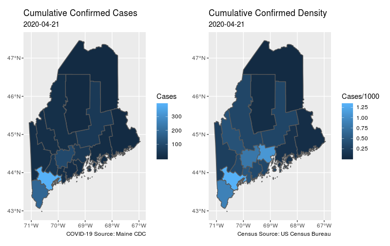

# MeCDC

Simplified access to some data from [Maine CDC](https://www.maine.gov/dhhs/mecdc/), in particular [COVID-19](https://www.maine.gov/dhhs/mecdc/infectious-disease/epi/airborne/coronavirus.shtml).

While this has been developed for [Computational Oceanography Lab](https://www.bigelow.org/science/lab/computational-oceanography/) coding ecosystem and [Bigelow Lab](https://www.bigelow.org/) it would be easy to adapt to other settings.

### Requirements

+ [R](https://www.r-project.org/)

 + [tidycensus](https://CRAN.R-project.org/package=tidycensus)
 
 + [sf](https://CRAN.R-project.org/package=sf)
 
 + [rvest](https://CRAN.R-project.org/package=rvest)
 
 + [xml2](https://CRAN.R-project.org/package=xml2)
 
 + [rlang](https://CRAN.R-project.org/package=rlang)
 
 + [dplyr](https://CRAN.R-project.org/package=dplyr)
 
 + [readr](https://CRAN.R-project.org/package=readr)
 
 + [ggplot2](https://CRAN.R-project.org/package=ggplot2)
 
 + [patchwork](https://CRAN.R-project.org/package=patchwork)

### Installation

```
remotes::install_github("BigelowLab/MeCDC"")
```

### Usage

Fetch the daily update of cumumaltive cases from [Maine CDC](https://www.maine.gov/dhhs/mecdc/infectious-disease/epi/airborne/coronavirus.shtml).

```
library(MeCDC)
x <- fetch_covid_cumulative()
x
# Simple feature collection with 16 features and 13 fields
# geometry type:  MULTIPOLYGON
# dimension:      XY
# bbox:           xmin: -71.08392 ymin: 42.97776 xmax: -66.9499 ymax: 47.45969
# epsg (SRID):    4326
# proj4string:    +proj=longlat +datum=WGS84 +no_defs
# # A tibble: 16 x 14
#    date  geoid County    pop density Confirmed Recovered Hospitalizations Deaths dConfirmed dRecovered dHospitalizatio…  dDeaths
#    <chr> <chr> <chr>   <dbl>   <dbl>     <dbl>     <dbl>            <dbl>  <dbl>      <dbl>      <dbl>            <dbl>    <dbl>
#  1 2020… 23001 Andro… 107679  230.          36        19               11      1     0.334      0.176            0.102   0.00929
#  2 2020… 23003 Aroos…  67111   10.1          2         1               NA     NA     0.0298     0.0149          NA      NA      
#  3 2020… 23005 Cumbe… 293557  351.         386       212               59     17     1.31       0.722            0.201   0.0579 
#  4 2020… 23007 Frank…  29897   17.6         13         5                1     NA     0.435      0.167            0.0334 NA      
#  5 2020… 23009 Hanco…  54811   34.5          6         2                1     NA     0.109      0.0365           0.0182 NA      
#  6 2020… 23011 Kenne… 122083  141.          97        24               14      4     0.795      0.197            0.115   0.0328 
#  7 2020… 23013 Knox    39771  109.          13         8                2     NA     0.327      0.201            0.0503 NA      
#  8 2020… 23015 Linco…  34342   75.3         12         8               NA     NA     0.349      0.233           NA      NA      
#  9 2020… 23017 Oxford  57618   27.7         14        10                1     NA     0.243      0.174            0.0174 NA      
# 10 2020… 23019 Penob… 151096   44.5         46        32                8     NA     0.304      0.212            0.0529 NA      
# 11 2020… 23021 Pisca…  16800    4.24         1         1               NA     NA     0.0595     0.0595          NA      NA      
# 12 2020… 23023 Sagad…  35634  140.          17         9                5     NA     0.477      0.253            0.140  NA      
# 13 2020… 23025 Somer…  50592   12.9         16         4               NA     NA     0.316      0.0791          NA      NA      
# 14 2020… 23027 Waldo   39694   54.4         43         5                1      8     1.08       0.126            0.0252  0.202  
# 15 2020… 23029 Washi…  31490   12.3          2         2               NA     NA     0.0635     0.0635          NA      NA      
# 16 2020… 23031 York   206229  208.         183       101               36      6     0.887      0.490            0.175   0.0291 
# # … with 1 more variable: geometry <MULTIPOLYGON [°]>
```

Or read an archived version.

```
x <- read_covid_cumulative("2020-04-21")
```

Make a graphics that shows cumulative counts and density by county.

```
plot_cumulative(x)
```

